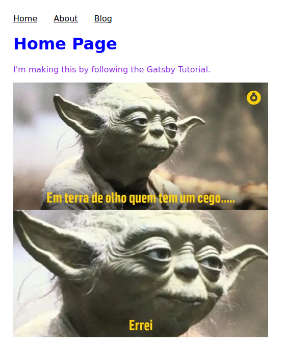

<p align="center">
  <a href="https://www.gatsbyjs.com/?utm_source=starter&utm_medium=readme&utm_campaign=minimal-starter-ts">
    
  </a>
</p>
<h1 align="center">
  Gatsby - Lab 1
</h1>

References: [What's Next  Gatsby](https://www.gatsbyjs.com/docs/tutorial/whats-next/)

## Technologies

- React
- Typescript
- Gatsby

## How To Run

### Run App

```shell
yarn start
```

### Demo



## Progress

